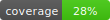

# Smart Mail Agent

## 快速開始
    cd ~/projects/smart-mail-agent
    python -m venv .venv && . .venv/bin/activate
    python -m pip install -U pip
    pip install -U -r requirements.txt || true
    export PYTHONPATH="src"

## CLI 執行
    PYTHONPATH=src python -m src.run_action_handler --help

## 測試與覆蓋
    pytest -q tests/unit tests/contracts -m "not online" \
      --cov=src/smart_mail_agent --cov-report=term-missing --cov-report=xml

## 產生 coverage 徽章
    python - <<'PY'
    import xml.etree.ElementTree as ET, pathlib
    svgdir = pathlib.Path("assets/badges"); svgdir.mkdir(parents=True, exist_ok=True)
    root = ET.parse("coverage.xml").getroot()
    pct = round(float(root.attrib.get("line-rate", 0)) * 100)
    badge = f'''<svg xmlns="http://www.w3.org/2000/svg" width="110" height="20">
    <linearGradient id="b" x2="0" y2="100%"><stop offset="0" stop-color="#bbb" stop-opacity=".1"/>
    <stop offset="1" stop-opacity=".1"/></linearGradient>
    <mask id="a"><rect width="110" height="20" rx="3" fill="#fff"/></mask>
    <g mask="url(#a)"><rect width="62" height="20" fill="#555"/><rect x="62" width="48" height="20" fill="#4c1"/>
    <rect width="110" height="20" fill="url(#b)"/></g>
    <g fill="#fff" text-anchor="middle" font-family="DejaVu Sans,Verdana,Geneva,sans-serif" font-size="11">
    <text x="32" y="15">coverage</text><text x="85" y="15">{pct}%</text></g></svg>'''
    (svgdir / "coverage.svg").write_text(badge, encoding="utf-8")
    print("badge:", svgdir / "coverage.svg", "value=", pct, "%")
    PY

## Linux 排程（範例）
    # 每小時執行一次（離線示範）
    0 * * * * cd $HOME/projects/smart-mail-agent && . .venv/bin/activate && OFFLINE=1 PYTHONPATH=src python -m src.run_action_handler --tasks classify >> logs/cron.log 2>&1
